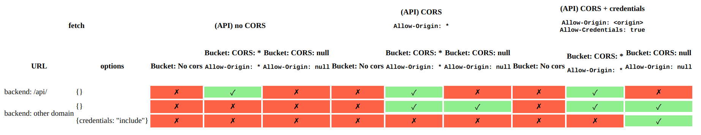

# This is demonstration code to see what bucket CORS configurations work when using a HTTP redirect

## How to use

* ```terraform init```
* ```terraform apply```
* open the resulting URL
* ```terraform destroy```

## How it works

It creates a website that calls an API which redirects to URLs in different buckets.

The buckets are configured in 3 way:

* No CORS configuration
* Allows ```*```
* Allows ```null```

The Lambda function also returns one of 3 configurations of CORS headers:

* No CORS headers
* Access-Control-Allow-Origin: *
* Access-Control-Allow-Origin: <origin>, Access-Control-Allow-Credentials: true

And finally, the backend call can be:

* On the same domain (/api)
* On a different domain
* On a different domain with {credentials: "include"} set

This gives 3x3x3=27 possible configurations. A HTTP request is sent by the browser to read the contents of a file and it reports whether it is successful or not.

Here are the results:


